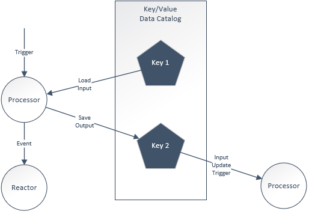
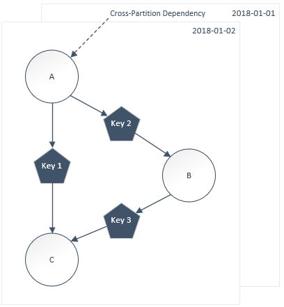

## RIFF Framework

Dependency graph-based distributed processing framework for rapid development of data-centric applications.

Source code distributed under GNU Affero General Public License v3.0 for user reference and troubleshooting purposes.

Please contact [rohatsu software studios limited](https://www.rohatsu.com) regarding implementations and commercial licensing.

&copy; 2014 - 2019 rohatsu software studios limited

### Features

* distributed execution of user-defined processes and event reactors
* automatic dependency triggers and processing order determination
* user programming model templates with strict dependency isolation
* event-aware object/object key-value data store
* date- and string-based data universe partitioning
* pre-built components for processing tabular data sets
* standardized interfaces for common file formats and prototols
* standalone, service, webapp and console extension points
* user web portal template with built-in system tools
* common runtime, logging and configuration frameworks
* Razor-based e-mail reporting templates
* built-in scheduler

### Use Cases

* Stateful workflows: tracking automated and manual steps with automatic progression
* Data warehouses: importing, normalizing and enriching external data sets
* Derived data caches: transforming raw data into standardized forms on each update
* Reactors: modelling chains of events running in serial or in parallel
* Batches: running, pausing and resuming batch jobs upon pending dependencies

### Technology Stack

* Windows Server 2008 R2+
* C# / .NET Framework 4.6.2
* ASP.NET MVC 5.2
* TypeScript 2.8
* XML serialization
* WCF
* SQL Server
* MSMQ

### Basic Concepts

#### Event-driven processing

User-defined processors and event reactors are invoked by the framework whenever
any of their registered inputs are updated or events triggered.

#### Dependency-driven processing

User-defined processors are automatically arranged into a dependency graph
based on their input/outputs and sorted topologically to minimize the number
of processing steps (A->B->C instead of A->C->B->C).

